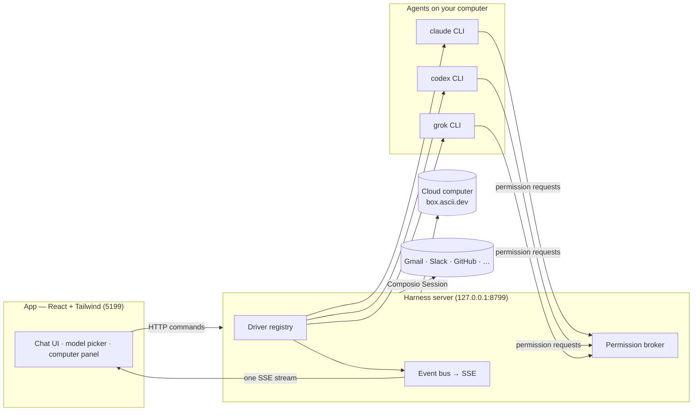

> ⚠️ **No affiliation with any cryptocurrency.** OpenMausBot has no token. Any coin using the OpenMausBot, Maus, or SupaMaus name is not created, endorsed, or affiliated with this project or its maintainer. I have received no tokens, payment, or allocation from anyone, and I will not be endorsing any token.

<div align="center">

# OpenMausBot

**Your own team of AI bots, in a chat app.**

<sub>An open-source version of **Grok Bot** — bring-your-own-agent, local-first, on the models you already have.</sub>

Every bot in the sidebar is a real agent — Claude or Codex running locally under the hood — with its own
personality, its own model, its own cloud computer, and its own connected apps.
Talk to them like contacts. Watch them work. Approve what matters.


<br>

<a href="https://github.com/milind-soni/openmausbot-releases/releases/latest/download/OpenMausBot.dmg">
  
</a>
&nbsp;
<a href="https://github.com/milind-soni/openmausbot-releases/releases/latest/download/OpenMausBot-intel.dmg">
  
</a>
&nbsp;
<a href="https://github.com/milind-soni/openmausbot-releases/releases/latest/download/OpenMausBot-setup.exe">
  
</a>
&nbsp;
<a href="https://github.com/milind-soni/openmausbot-releases/releases/latest/download/OpenMausBot-amd64.deb">
  
</a>

<sub>macOS: Apple silicon & Intel · signed & notarized .dmg &nbsp;·&nbsp; Windows: x64 installer &nbsp;·&nbsp; Ubuntu 24.04 x64: .deb or AppImage beta &nbsp;·&nbsp; [all releases](https://github.com/milind-soni/openmausbot-releases/releases)</sub>

<br>
<br>


</div>

---

## Why

One assistant in one box is the wrong shape for agents. OpenMausBot is an open-source take on **Grok Bot** —
it keeps the idea (AI as a *messaging app*: a roster of bots you chat with, each with its own personality,
memory of its thread, model, computer, and apps) and rebuilds it open, local-first, and on the agents you
already have:

- **Bring your own agents.** Bots run on the `claude`, `codex`, and `grok` CLIs installed on your own machine
  — your existing logins and subscriptions, no new accounts, no proxy in the middle. Point any engine at a
  custom CLI binary (a versioned build or wrapper) in **Settings → Engines**.
- **Local first.** One small harness server on `127.0.0.1` owns every agent process. Transcripts, keys, and
  events live in `~/.openmausbot`, not a cloud.
- **Agents with hands.** Each bot can use a cloud Linux desktop, an isolated Local VM, or your own computer,
  plus 500+ apps through Composio. Host control is available on macOS and as an explicit Ubuntu GNOME beta.

## Features

<table>
<tr>
<td width="50%" valign="top">

### 🧠 Pick a brain per bot

A model picker with a provider rail — Claude and Codex models side by side, defaults marked, unavailable
providers dimmed with the reason. Switch a bot's model mid-conversation.


</td>
<td width="50%" valign="top">

### 🖥️ Every bot gets a computer

Open the Computer panel and the bot's cloud desktop spins up on its own — live screen preview while it
works, "Open desktop" to take over in your browser, or point the bot at *this Mac* instead.


</td>
</tr>
<tr>
<td width="50%" valign="top">

### 🙋 Bots ask before they act

Shell commands, file edits, and questions surface as inline cards — Allow / Deny / answer in chat. A
permission broker turns every risky action into a decision you make, for cloud and local computers alike.


</td>
<td width="50%" valign="top">

### 🔌 Connected apps

A one-click marketplace over Composio Sessions: Gmail, Slack, GitHub, Notion, Linear and hundreds more.
OAuth once, and every bot can use them as tools.


</td>
</tr>
<tr>
<td width="50%" valign="top">

### 🗂 Manage bots like chats

Right-click any bot: pin, mark unread, edit profile, duplicate, copy conversation ID, hide, delete. It's a
messaging app — your agents behave like contacts.


</td>
<td width="50%" valign="top">

### 🔑 Keys once, everything lights up

Paste credentials in App Settings — they persist locally and the provider fleet hot-reloads instantly.
Secrets are write-only: the UI only ever sees "configured" flags.


</td>
</tr>
</table>

### 🎧 Bots that talk back

Press the speaker on any reply, or switch a bot to read its answers out as they land — so you can listen
to what ran overnight while you make breakfast. Hit **call** and it's a conversation: it hears you, tells
you what it's doing while it works, and asks for approvals out loud.

Bring your own ElevenLabs key — paste it once in App Settings, pick a voice, and every bot can talk.
Give a bot its own voice and a room stops sounding like one person.

**Also in the box:** streaming replies with tool-run activity chips · native macOS dictation from the
composer mic (on-device Apple speech recognition — desktop app) · SupaMaus cursor mascots with role-aware
expressions · screenshots of the bot's work folded into the transcript.

## How it works

Two processes. The app holds no transports of its own — it sends typed commands over HTTP and folds one SSE
event stream into state. The harness server owns every agent process and normalizes each provider's native
protocol into one canonical runtime event stream (logged per-thread as NDJSON).



| Layer | Where | What it does |
|---|---|---|
| Drivers | `server/drivers/` | One per provider: Claude, Codex, and Grok Build over their local CLIs (stream-JSON / JSON-RPC / ACP), plus a cloud-computer agent. Unknown drivers degrade to "unavailable", never crash the fleet. |
| Harness | `server/harness/` | Registry (configs → live instances) and the fan-in event bus every client folds. |
| API | `server/index.ts` | Bots, turns, approvals, model catalog, computer lifecycle, connectors, config — HTTP + SSE. |
| Voice | `server/tts/` | ElevenLabs, bring your own key. Runs on the harness so the key never reaches the UI; markdown is rewritten into something worth hearing before it is spoken. |
| App | `src/` | The chat shell. Server-backed store, one reducer, zero client-side transports. |
| Desktop | `electron/` | macOS, Windows, and Ubuntu shells with an embedded harness and platform capabilities; Apple speech stays macOS-only, while a release-pinned bundled CUA runtime enables guarded Ubuntu GNOME local control. |

## Quick start

**Released builds:** the harness server is embedded, so no separate server setup is required.

| | Download | Install |
|---|---|---|
| **macOS** (Apple silicon) | [OpenMausBot.dmg](https://github.com/milind-soni/openmausbot-releases/releases/latest/download/OpenMausBot.dmg) | Drag it to Applications, open it. Signed & notarized. |
| **macOS** (Intel) | [OpenMausBot-intel.dmg](https://github.com/milind-soni/openmausbot-releases/releases/latest/download/OpenMausBot-intel.dmg) | Same app, built for Intel Macs. Signed & notarized. |
| **Windows** (x64) | [OpenMausBot-setup.exe](https://github.com/milind-soni/openmausbot-releases/releases/latest/download/OpenMausBot-setup.exe) | Run it — one-click, per-user, no admin rights. The installer isn't code-signed yet, so SmartScreen shows "unknown publisher": **More info → Run anyway**. |
| **Ubuntu 24.04** (x64) | [OpenMausBot-amd64.deb](https://github.com/milind-soni/openmausbot-releases/releases/latest/download/OpenMausBot-amd64.deb) · [OpenMausBot.AppImage](https://github.com/milind-soni/openmausbot-releases/releases/latest/download/OpenMausBot.AppImage) | Install the `.deb` with APT (recommended), or make the AppImage executable and run it. Beta; GNOME is the supported desktop. |

See the [Ubuntu Desktop guide](docs/linux-desktop.md) for installation, capabilities, and troubleshooting.

**From source:**

```sh
git clone https://github.com/milind-soni/OpenMausBot && cd OpenMausBot
pnpm install

pnpm dev:server    # harness server → 127.0.0.1:8799
pnpm dev           # app → http://127.0.0.1:5199
pnpm dev:desktop   # Electron shell; keep the two commands above running
```

Requirements: **macOS, Windows, or Ubuntu 24.04 x64**, **Node 24+**, **pnpm**, and at least one agent CLI — [`claude`](https://claude.com/claude-code),
[`codex`](https://github.com/openai/codex), or [`grok`](https://x.ai/cli) — installed and logged in. They appear
in the model picker automatically.

Package the desktop application:

```sh
pnpm package:mac      # macOS: DMG + ZIP; requires Swift/Xcode tools
pnpm package:win      # Windows: installer + ZIP
pnpm package:linux    # Ubuntu x64: .deb + AppImage + verified CUA runtime
```

### Desktop capability status

| Capability | macOS | Ubuntu 24.04 Xorg | Ubuntu 24.04 Wayland |
|---|---|---|---|
| Packaged app, embedded harness, local agent CLIs | Supported | Beta | Beta |
| Composio and Box/cloud computers | Supported | Beta | Beta |
| Explicit preview-only local screen capture | Supported | Beta | Beta |
| Bot control of this computer | Supported | Beta: opt-in, bundled Cua 0.19.3 | Beta: GNOME only, opt-in, bundled Cua 0.19.3; separately installed WinRects v8 helper |
| Native on-device dictation | Supported | Planned | Planned |

The Linux preview is user-initiated and never enables local bot control or Auto routing. Packaged Linux builds ship
the exact Cua Driver 0.19.3 runtime outside ASAR; control still requires explicit app opt-in and an explicit per-bot
**This computer** selection, and every local action asks for approval. GNOME/Wayland additionally requires the
versioned WinRects v8 helper and a
passing prompt-free AT-SPI/capture/portal health report. Other Wayland compositors fail closed without blocking
chat or cloud features. See the [Ubuntu Desktop guide](docs/linux-desktop.md) and
tracking issues [#29](https://github.com/milind-soni/OpenMausBot/issues/29) and
[#79](https://github.com/milind-soni/OpenMausBot/issues/79) / [#109](https://github.com/milind-soni/OpenMausBot/issues/109) / [#113](https://github.com/milind-soni/OpenMausBot/issues/113).

The Linux packager downloads only the tag-pinned upstream archive during the build, verifies its size, SHA-256,
complete member allowlist, and inner executable hashes, then packages only the CLI and cursor-theme sidecar. The
installed app never downloads or self-updates native automation code. Cua's MIT notice, Inter's SIL OFL, a generated
third-party license report, and a CycloneDX inventory ship with the runtime. See
[`third_party/cua-driver/`](third_party/cua-driver/) for the reviewed provenance record.

These credentials are optional — local chat works without them. Paste a key once in **App Settings** (gear
in the sidebar footer) when you want to enable its integration:

| Credential | What it enables | Where to get it |
|---|---|---|
| Composio project key (`ak_…`) | Connect Gmail, GitHub, Slack, Notion, and other apps to your bots | [OpenMausBot Composio setup](docs/composio.md) |
| Box API key | Give bots an isolated remote Linux computer with a desktop and terminal | [Box API key guide](https://docs.ascii.dev/box/api-keys) |
| ElevenLabs key | Read replies aloud, and call your bots | [ElevenLabs API keys](https://elevenlabs.io/app/settings/api-keys) |

Composio and Box are third-party services with their own accounts and terms. Box is a paid service after
its trial, and using a cloud computer may incur charges.

```sh
pnpm typecheck     # app + server
pnpm test          # unit, driver, API, and desktop capability tests
pnpm build         # typecheck + production build
pnpm check:electron # syntax-check Electron main/preload files
pnpm package:win   # Windows installer + zip → release/
pnpm package:linux # Ubuntu x64 .deb + AppImage → release/
```

### Routines and webhook triggers

Routines can run once or on selected weekdays, using either a MAUS's configured model/computer or the
Cloud VM runner. Webhook triggers are independent from schedules but reuse the same queued task executor
and calendar receipts.

OpenMausBot starts a webhook-only receiver on `127.0.0.1:8800` by default (or one port above `OMB_PORT`).
Set `OMB_WEBHOOK_PORT` to choose another port. A webhook secret is shown once when the trigger is created
or rotated. Bearer authentication is recommended so the secret stays out of request URLs and most access
logs; a single capability URL remains available for senders that cannot configure headers. The receiver
exposes only `/health` and secret `/hooks/...` endpoints; it never exposes the app's broader API.
OpenMausBot must remain running to accept a delivery. For public internet delivery, proxy only this
dedicated receiver through a hosted relay or a tool such as Tailscale Funnel.

## Status

Early but real — the loop works end to end: message → agent → streamed reply → tools → approvals →
computer use. macOS, Windows, and Ubuntu 24.04 x64 have released builds; Ubuntu remains a beta with the
capability limits above. Rough edges to expect: hosted/mobile connectivity is still being built, and webhook
triggers currently use the local receiver rather than an always-on hosted relay.
Voice needs an ElevenLabs key, and calls are macOS-only for now (they ride the same on-device dictation as
the composer mic) — see [`docs/voice-mode.md`](docs/voice-mode.md) for the design and the known gaps.

Contributions welcome — the driver SPI in [`server/contracts.ts`](server/contracts.ts) is deliberately
small; adding a provider is one file in [`server/drivers/`](server/drivers/) plus a one-line registration.

## License

[Apache License 2.0](LICENSE) © 2026 Milind Soni and OpenMausBot contributors.

Packaged Cua Driver components retain their upstream MIT, SIL OFL 1.1, MPL-2.0, and other dependency terms;
the corresponding notices, license texts, source locations, and SBOM are in
[`third_party/cua-driver/`](third_party/cua-driver/) and ship beside the native runtime.

OpenMausBot is an independent, open-source project inspired by Grok Bot. It is
not affiliated with, endorsed by, or associated with xAI; "Grok" is a trademark
of its respective owner.
